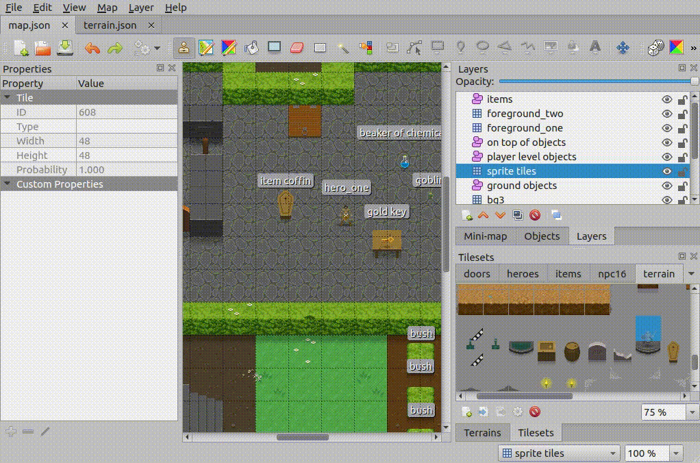
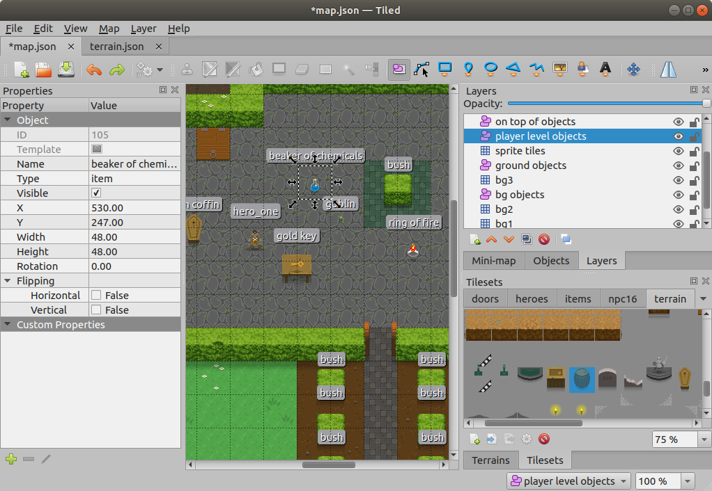
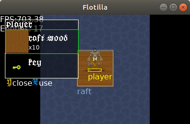
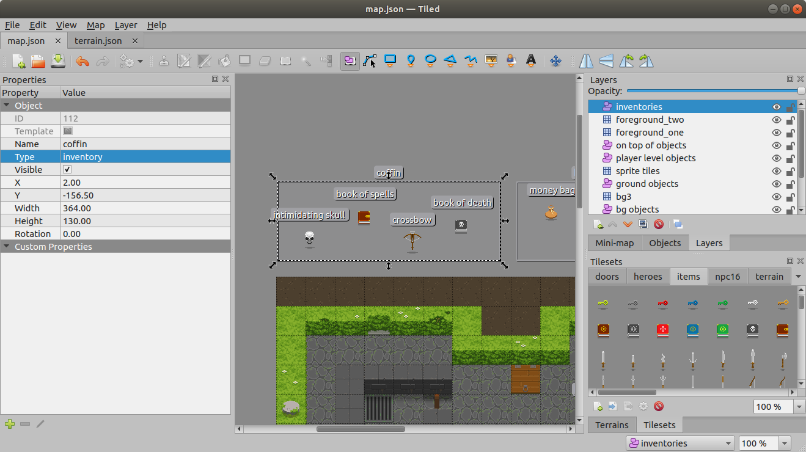
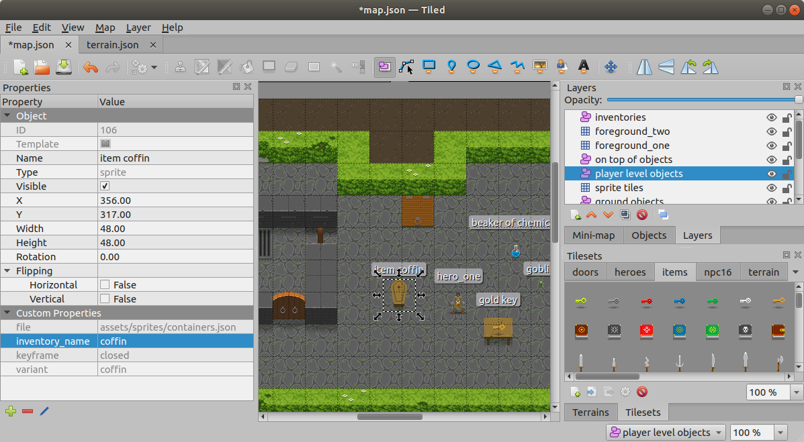
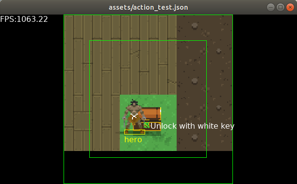

# Map Creation


Terrain and Background
----------------------
You can build terrain like you would in any Tiled map. Import a terrain tileset
and start placing tiles down in layers. As expected, layers are rendered from
bottom to top.


Animation
---------
Animations are created using the [Tile Animation Editor][animation_editor].
Simply placing an animated tile on the map introduces its animation into the ECS.


Boundaries
----------
Boundaries can be placed on the map as a top level object or can be placed within
tiles in the [Tile Collision Editor][collision_editor]. They then percolate into
the map as component objects of each instance of the tile. This makes it easy to
set the boundary for all instances of tile like "wall left" or "bush" or "rock".

### To place a top level object boundary

* Select the layer the boundary should live in
* Insert a new rectangle object into the layer
* Set the recangle object's `Type` property to `barrier`


### To add and place tile boundaries

* Edit the tileset that includes the tile
* Select the tile
* Open the [Tile Collision Editor][collision_editor]
* Insert a new rectangle object
* Set the recangle object's `Type` property to `barrier`



### Debug rendering boundaries

Boundaries can be rendered for debugging using debug toggles in the
`RenderingSystem`:

```rust,ignore
  let mut rendering_system = RenderingSystem::new(&mut canvas, &texture_creator);
  rendering_system.toggles.insert(RenderingToggles::Barriers);
```


Items
-----
Items are simply objects with their `Type` property set to `item`. This allows
them to be placed into inventories.



### Optional properties
Items have two optional properties - `usable` and `stack_count`.

| property name | value             | description                                                                   |
|---------------|-------------------|-------------------------------------------------------------------------------|
| usable        | `true`, `false`   | whether or not this item is usable from an inventory                          |
| stack         | `0`, `1`, `2` ... | tells the engine this item is stackable, and how many there are in this stack |



<small>A 10 stack of raft wood.</small>

Once an item is on the map, it can be picked up by any player. Once an item is
in a player's inventory it can be viewed by hitting the `Y` button and dropped
by hitting the `B` button while the inventory is open and the item is selected.

<video src="./img/drop_items.mp4" controls></video>

Inventories
-----------
An inventory is a collection of items that live on a special `inventories` layer.
Objects can then reference an inventory using a custom parameter `inventory_name`
with its value set to the value of the inventory's `Name` property.

### Creating an inventory

* Create a layer named `inventories` if one doesn't already exist
* In the `inventories` layer, place a new rectangle object and make sure that it
  is big enough to hold all the items you plan on keeping within it
* Set the object's `Type` property to `inventory`
* Set the object's `Name` property to something unique
* Place your items within the rectangle object. These items are now "stored" in
  the inventory



### Referencing an inventory

To associate an inventory with an object (such as a player, npc or container),
add a custom property `inventory_name` on the object and set its value to the
value of the `name` property of the inventory object.




[Actions](./map_creation/actions.md)
-------
Actions are special components that allow characters to interact with the world.



<small>A player's available action</small>


[Sprites](./map_creation/sprites.md)
-------
Sprites are complex game objects whose assets and attributes are defined within
a Tiled map file. Sprites are used to create objects that a player can interact
with. Certain Sprites are controlled by special game systems.


Characters
----------
A character is a hero, creature, monster, enchanted object, moldy flapjack or
anything else that is controlled by either a player or an automatic inspiration AKA
an AI ;).

### To place a character

* Create an object layer if one doesn't already exist
* Use the `Insert Tile` tool to add a tile object to the layer
* Set the `Name` of the object (can be anything)
* Set the `Type` of the object to `character`
* Add a custom property `control`
* Follow the below steps for player or non-player characters

### Player Characters

* Set the value of the `control` property to `player`
* Add a custom property `player_index`
* Set the value of the `player_index` property to an integer, eg. `0`, `1`, `2` ...
  This will represent the controller used to control the character

### Non-player Characters

* Set the value of the `control` property to `npc`
* Add a custom property `ai`
* Set the value of the `ai` property to one of the supported AI types (TODO)


### Properties

#### Required

| property name | value             | description                            |
|---------------|---------------------------|----------------------------------------|
| name          | any unique string         | name of the character, can be anything |
| type          | `character`               | tells the engine that this is a toon   |
| control       | must be `player` or `npc` | determines the control scheme          |

#### conditional

| property name | value         | description                              |
|---------------|---------------|------------------------------------------|
| player_index  | `0`, `1`, ... | the controller used to control this toon |
| ai            | ?_            | the ai used to control this toon         |

#### Optional

| property name  | value                                              | description                             |
|----------------|----------------------------------------------------|-----------------------------------------|
| inventory_name | any unique value, must match some inventory's name |                                         |
| z_inc          | an integer, eg. `-1`, `1`, `2`                     | adds an integer to the object's z_level |
| max_speed      | some float value                                   | sets the max speed                      |

### Optional Objects
Barrier and offset objects can be placed on the character's tile/animation and
they will be recognized.


[animation_editor]: https://doc.mapeditor.org/en/stable/manual/editing-tilesets/#tile-animation-editor
[collision_editor]: https://doc.mapeditor.org/en/stable/manual/editing-tilesets/#tile-collision-editor
